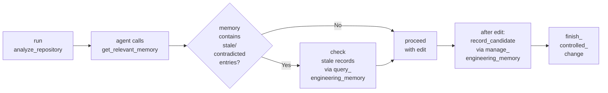

## What it is

Engineering Memory is a local SQLite store that persists repository facts linked to CodeClone runs. It records decisions, risks, and evidence to help agents understand context across sessions. Unlike chat, memory survives conversation boundaries and remains anchored to specific commits and file paths.

## When to use it

**Use memory in these situations:**

- You need facts from a prior CodeClone session to inform the current work
- You are recording a non-obvious debugging decision that the next agent should know
- A finding is stale or contradicted and you need to surface why
- You want to assert that a specific file change has a documented rationale

**Do not use memory for:** temporary observations, chat summaries, or transient coordination state (those go in intent tracking, not memory).

## Basic workflow

## Key commands

| Command | Tool | Purpose |
|---------|------|---------|
| `memory init` | CLI | Create or validate the memory store for a repository |
| `memory status` | CLI | Show memory schema version and store size |
| `get_relevant_memory` | MCP | Fetch ranked, evidence-linked facts for a declared scope |
| `query_engineering_memory` | MCP | Inspect memory by mode: `search`, `for_path`, `stale`, `coverage`, `trajectory_*` |
| `manage_engineering_memory` | MCP | Write or refresh: `record_candidate`, `refresh_from_run`, `rebuild_semantic_index` |
| `memory approve` | CLI | Promote a draft record to active (requires human review in VS Code) |

## Common mistakes

**Treating memory as a cache or inventory:** Memory is commit-anchored, not disk-anchored. A file deletion does not invalidate memory notes about that file; staleness is measured against the anchor commit, not inventory membership.

**Ignoring stale warnings:** When `get_relevant_memory` returns records marked `stale`, investigate them first. Stale does not mean false; it means context has shifted. A stale decision may still apply.

**Recording vague observations:** Memory statements must be specific and actionable. Avoid "this code is confusing" — instead: "UpdateSchema logic in schema_migrate.py must reuse _add_column_if_missing; schema-version bumps require version pin updates in tests."

**Confusing memory with engineering decision records:** Memory records drift-sensitive repository facts, not product roadmaps or design philosophy. Use `record_type=change_rationale` for "why this fix happened," not for long-term strategic intent.

## Next steps

- **For stale records:** Use `query_engineering_memory(mode=stale)` to list staleness reasons, then decide whether to update, archive, or act on the note anyway.
- **For semantic search:** After semantic indexing completes, use `query_engineering_memory(mode=search, text="keyword")` to find related notes across the codebase.
- **For trajectory review:** Use `query_engineering_memory(mode=trajectory_search)` to inspect episode history of a specific file or decision.
- **Integration with MCP:** When writing memory, pass `root` (absolute path) and either `scope` or `intent_id`. MCP validates the store before returning ranked results.

See [Engineering Memory concepts](../concepts/engineering-memory.md) for architecture and storage guarantees.
