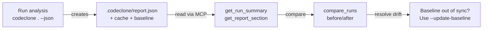

## What it is

CodeClone analysis is written to disk as a report—a structured file containing findings, metrics, and integrity checksums. Reports exist in five formats (JSON, HTML, Markdown, SARIF, text) and are stored by default in `.codeclone/` alongside a baseline snapshot (`codeclone.baseline.json`) and an analysis cache. This guide helps you understand what each report contains, where they live, and how to troubleshoot missing or unexpected data.

## When to use it

Use this troubleshooting guide when:

- A report doesn't exist after running analysis
- Report output format looks incomplete or malformed
- You need to compare two analyses to spot regressions
- Baseline and report are out of sync
- Report schema validation fails

## Basic workflow

Analysis produces three artifacts:
1. **Report** (`.codeclone/report.<ext>`) — findings, metrics, integrity data
2. **Baseline** (`codeclone.baseline.json`) — snapshot for regression detection
3. **Cache** (`.codeclone/*.cache`) — incremental state to speed up re-runs

## Key commands

| Command | Purpose | Notes |
|---------|---------|-------|
| `codeclone . --json` | Write JSON report to `.codeclone/report.json` | Default location; use `--json FILE` to override |
| `codeclone . --html` | Write HTML report with interactive UI | Requires rendering; open in browser |
| `codeclone . --md` | Write Markdown report | Good for CI logs and version control review |
| `codeclone . --update-baseline` | Snapshot current state as truth | Use after fixing real issues, not as a silence toggle |
| `codeclone . --sarif` | Write SARIF JSON for IDE integration | SARIF 2.1.0 format for GitHub/GitLab scanners |

Each flag defaults to `.codeclone/report.<ext>` unless you provide a path argument.

## Common mistakes

**Mistake 1:** Assuming `--update-baseline` silences findings.
- **Reality:** It replaces the baseline snapshot. If your code still has the issues, they'll reappear on the next run.
- **Fix:** Only use `--update-baseline` after you've actually fixed the underlying structural problems.

**Mistake 2:** Running analysis and not checking report integrity.
- **Reality:** Corrupted cache or missing dependencies can produce incomplete reports.
- **Check:** Open the report; verify `integrity` section shows `status: "ok"`.

**Mistake 3:** Comparing runs across different repositories or commit hashes.
- **Reality:** `compare_runs` requires the same root and analysis scope.
- **Check:** Both runs must target the same repository and use compatible settings.

**Mistake 4:** Forgetting report format applies to output only.
- **Reality:** Analysis is the same; format (JSON, HTML, text) doesn't change what findings you get.
- **Check:** If findings differ between formats, the cache is stale—re-run without `--cache`.

## Next steps

- Read the examples guide for sample JSON structure and interpretation
- Use the MCP service tools (`get_run_summary`, `get_report_section`, `compare_runs`) to programmatically query reports
- Check Engineering Memory documentation for structural decisions about cache and baseline versioning
- If a report fails validation, ensure your CodeClone version matches the baseline schema version (currently `2.1`)
