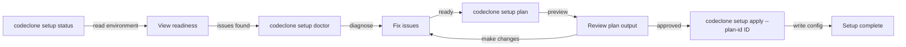

# Setup troubleshooting

## What it is

`codeclone setup` is a workflow for initializing CodeClone in your repository. It validates your environment (via `status` and `doctor`), generates a configuration plan (`plan`), and applies it safely (`apply`). The workflow prevents accidental writes through confirmation requirements and plan binding.

## When to use it

Use this guide when:

- `codeclone setup` commands fail or behave unexpectedly
- You see warnings about missing dependencies or configuration
- You need to preview changes before applying them
- You're running setup in automation (CI/CD)

## Basic workflow



## Key commands

| Command | Purpose | Common flags |
|---------|---------|--------------|
| `codeclone setup status` | Check readiness without making changes | `--json` for machine output |
| `codeclone setup doctor` | Diagnose issues preventing setup | `--json` for parseable format |
| `codeclone setup plan` | Generate a configuration plan | `--dry-run`, `--json` |
| `codeclone setup apply` | Write configuration to disk | `--yes`, `--plan-id ID`, `--dry-run` |
| `codeclone setup wizard` | Interactive guided setup | None typically needed |

### Apply safety flags

- **`--yes` / `-y`**: Skip confirmation prompt (required for non-interactive environments)
- **`--plan-id PLAN_ID`**: Bind apply to a previewed plan; exits with `status=stale_plan` (exit code 2) if the plan is outdated
- **`--dry-run`**: Preview writes without persisting to disk
- **`--root ROOT`**: Specify repository root (default: current directory)

## Common mistakes

**Mistake 1: Running apply without plan preview**

```bash
# Bad: no way to review what will be written
codeclone setup apply --yes

# Good: preview first, then apply
codeclone setup plan
codeclone setup apply --yes --plan-id <ID_FROM_PLAN>
```

**Mistake 2: Ignoring plan staleness**

If changes occur between `plan` and `apply`, the `--plan-id` check catches it:

```bash
# Plan generated at timestamp T1
codeclone setup plan --json
# ... (other changes made to repo)
# Apply fails if plan is stale
codeclone setup apply --yes --plan-id old-id
# Exit code 2: status=stale_plan
```

**Mistake 3: Missing --yes in CI/CD**

```bash
# Bad: blocks forever waiting for interactive confirmation
codeclone setup apply

# Good: explicitly confirm non-interactively
codeclone setup apply --yes
```

**Mistake 4: Assuming status indicates readiness**

`status` and `doctor` report findings; readiness is determined internally. Use the output to guide fixes, then re-run status to verify.

## Next steps

- Review the `--help` output for each command: `codeclone setup apply --help`
- Use `--json` flags to parse output in scripts
- Report unexpected failures with `codeclone setup doctor --json` output
- For additional setup questions, check the main documentation site at https://orenlab.github.io/codeclone/
