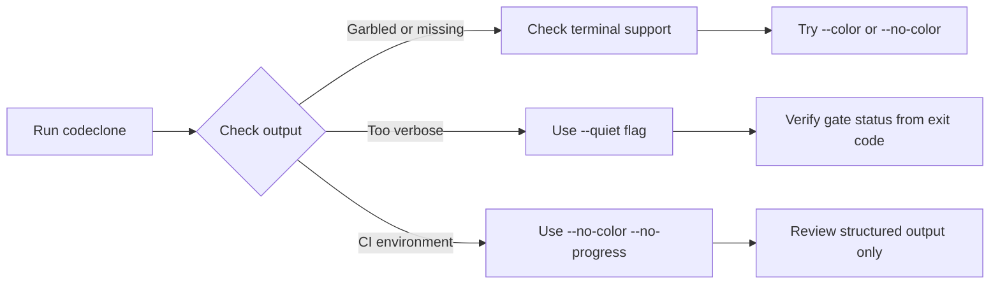

# Terminal output troubleshooting

## What it is

CodeClone's terminal output communicates analysis status, progress, and results through ANSI colors, Unicode progress indicators, and structured text. Understanding output modes and control flags helps you debug display issues, integrate with CI systems, and read findings efficiently.

## When to use it

Use this guide when:
- Terminal output is garbled, colorless, or missing entirely
- Progress indicators are broken or unreadable in CI logs
- You need to redirect or suppress output for scripting
- Colors or Unicode conflict with your terminal emulator or CI runner

## Basic workflow

## Key commands

| Flag | Behavior | Use when |
|------|----------|----------|
| `--no-progress` | Suppress progress spinner and status lines | CI logs, log aggregation |
| `--progress` | Force-enable progress output | Terminal stalled, progress hidden |
| `--no-color` | Strip ANSI color codes | CI runner, non-TTY output, broken terminal |
| `--color` | Force-enable colors | Terminal emulator doesn't detect TTY |
| `--quiet` | Show only warnings, errors, summaries | Noisy output, integration scripts |
| `--verbose` | Include detailed clone identifiers | Debugging, NEW finding investigation |
| `--debug` | Print traceback and environment info | Internal error diagnosis |

## Common mistakes

**Mistake:** Running in CI with colors and progress enabled.
- Result: ANSI codes pollute logs, progress spinners hang the output.
- Fix: Use `--ci` preset (equivalent to `--fail-on-new --no-color --quiet`) or pass `--no-progress --no-color` explicitly.

**Mistake:** Expecting Unicode progress bar in non-UTF8 terminals.
- Result: Progress spinner displays as garbage characters.
- Fix: Use `--no-progress` or ensure terminal locale is UTF-8.

**Mistake:** Piping output without `--quiet` or `--no-progress`.
- Result: Progress spinners block the pipe, output mixes with control characters.
- Fix: Add `--quiet --no-progress` when piping to files or other commands.

**Mistake:** Suppressing all output with `--quiet` then ignoring exit codes.
- Result: Gating failures are silent, CI passes when it should fail.
- Fix: Always check `echo $?` or your CI runner's exit code variable in scripts.

## Next steps

- **Color and progress not working:** Verify your terminal supports ANSI (check `echo $TERM`) and try `--color --progress` explicitly.
- **Need structured output:** Use `--json`, `--html`, `--md`, or `--sarif` to generate reports independent of terminal output.
- **Integrate with CI:** Pass `--ci` or `--quiet --no-color --no-progress` depending on log retention needs.
- **Debug internal errors:** Use `--debug` and include the full traceback in issue reports.
- **Script integration:** Capture exit code with `$?` in bash or `$LASTEXITCODE` in PowerShell to gate on gating failures.
